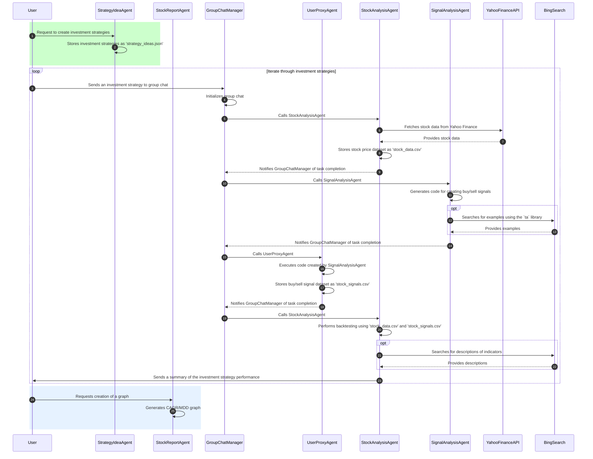

## Best time to buy/sell: Sell in May, buy in October

### Overview

💸Agent-based stock analysis and investment strategy application using 🎰AutoGen framework, focusing on MSFT stock.

- Review historical stock performance of Microsoft from the past 10-20 years.
- Identify patterns and trends.
- Autogen Agents for finding the best timing to invest.
  - [Documentation](https://microsoft.github.io/autogen/)
  - [Tutorial](https://microsoft.github.io/autogen/docs/Examples)
  <!-- - [Autogen studio](https://microsoft.github.io/autogen/docs/autogen-studio/getting-started) `cmd> autogenstudio ui --port 8081` -->
  - [Skills Repository](https://github.com/madtank/autogenstudio-skills)
- To run the main workflow: `python agent_workflow_e2e.py`

> Important: The code in this repository was developed during a hackathon and implemented within a limited timeframe. It is intended for proof-of-concept purposes only.

### Sequence diagram



### User Input and Results

- User Input

```bash
Run complete stock analysis for MSFT from 1995-01-01 to today. 
Generate buy/sell signals using 20-day Moving Average, TRIX, UO.
Based on the generated signals, backtest the strategy and provide performance metrics.
```

- Results

```bash
### Strategy Performance Summary

**Indicators Used:**
- 20-day Moving Average (MA)
- TRIX (Triple Exponential Average)
- Ultimate Oscillator (UO)

**Strategy Summary:**
The strategy employs a combination of technical indicators to generate buy and sell signals. The 20-day Moving Average smooths price data to identify trends, while the TRIX indicator assesses momentum and potential trend reversals. The Ultimate Oscillator helps gauge market momentum by considering multiple time frames.

Buy signals are generated when the stock price is above the 20-day MA, TRIX is positive, and UO is below 50, indicating a potential upward trend. Conversely, sell signals are triggered when the price is below the 20-day MA, TRIX is negative, and UO is above 50, suggesting a downward trend. This strategy aims to capture momentum while managing risk effectively.

### Performance Metrics

| Metric               | Value    |
|----------------------|----------|
| **Cumulative Return** | 188.17%  |
| **CAGR**             | 2.15%    |
| **Maximum Drawdown** | -4.47%   |
| **Sharpe Ratio**     | 0.04     |
```

### CAGR calculation

- Most backtrading systems already integrate buy/sell signals and CAGR (Compound Annual Growth Rate) calculation into a single interface. However, this approach limits the flexibility to use custom signals for CAGR calculation.
- To resolve this issue, the app uses an approach that separates signal generation and CAGR calculation.

  - **Assumptions**

    - To streamline the process, we make the following assumptions:

      1. All trading decisions are based on the signal generated from the previous day's data.
      1. The calculation of daily returns depends on the type of signal and the price movement:

      - **Buy Signal:** On the trading day, the daily return is calculated as the change of the Adjusted Close price.

      - **Sell Signal:** On the trading day, the daily return is calculated as the gap between the previous day's Close price and the current day's Open price: `Daily Return = ({Open} / {Prev Day Close}) - 1`

  - **Signal Validation**

    - Each trade checks the validity of the signal:

      1. A sell signal cannot be executed without a preceding buy signal.
      1. Consecutive identical signals (e.g., multiple buy signals in a row) are treated as a **Hold** action, where no new trade is initiated.

### Configurations and Setup

  ```bash
  poetry install --no-root
  ```

- This application library supports [`ta`](https://github.com/bukosabino/ta), which provides commonly used indicators (pure Python).
- Another backtesting framework will be supported in the future.
- Rename `.env.template` to `.env` and `OAI_CONFIG_LIST.template.json` to `OAI_CONFIG_LIST.json`. Then, set your Bing Search API and OpenAI keys.

### Python Libraries for Quant Trading 

- Zipline: Maintained and updated by the community after Quantopian shut down. [git](https://github.com/stefan-jansen/zipline-reloaded)
- backtrader: Python Backtesting library for trading strategies [git](https://github.com/mementum/backtrader)
- QuantStats: [git](https://github.com/ranaroussi/quantstats)
- fastquant: [git](https://github.com/enzoampil/fastquant)
- TA-Lib Official Site: 200 indicators such as ADX, MACD, RSI, Stochastic, Bollinger Bands etc. Candlestick patterns. Faster (C-based). recognition. [git](https://ta-lib.org/)
  - TA-Lib python wrapper should be downloaded by manual.
  - unofficial TA-Lib wheels for Python on Windows: https://github.com/cgohlke/talib-build

```bash
python -m pip install TA_Lib-0.4.32-cp311-cp311-win_amd64.whl
```

- finta: Common financial technical indicators implemented in Pandas. archived repository. [git](https://github.com/peerchemist/finta)
- [FinRobot](https://github.com/AI4Finance-Foundation/FinRobot) uses GroupChat for multiple agents
  - GroupManager controls mutiple agents. It can be used to manage multiple agents in a group chat.
